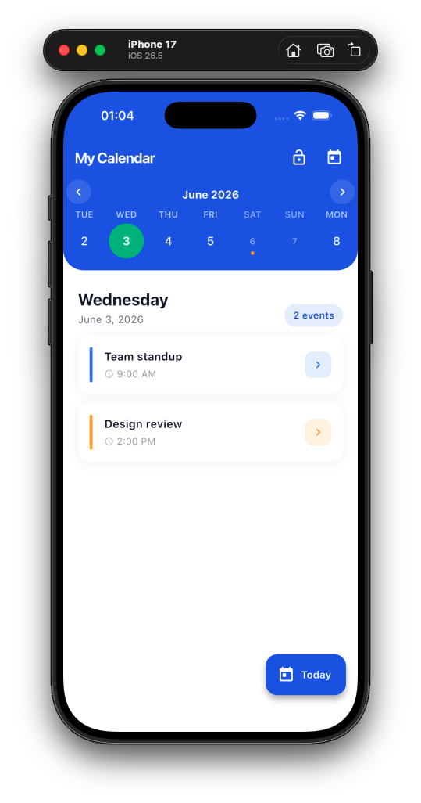

### Flutter calendar week
Flutter calendar week UI package


##### Screenshot:


<br>

```Dart
import 'package:flutter_calendar_week/flutter_calendar_week.dart';
```

```Dart
CalendarWeek(
              controller: CalendarWeekController(),
              height: 100,
              showMonth: true,
              minDate: DateTime.now().add(
                Duration(days: -365),
              ),
              maxDate: DateTime.now().add(
                Duration(days: 365),
              ),
              
              onDatePressed: (DateTime datetime) {
                // Do something
              },
              onDateLongPressed: (DateTime datetime) {
               // Do something
              },
              onWeekChanged: () {
                // Do something
              },
              monthViewBuilder: (DateTime time) => Align(
                  alignment: FractionalOffset.center,
                  child: Container(
                      margin: const EdgeInsets.symmetric(vertical: 4),
                      child: Text(
                        DateFormat.yMMMM().format(time),
                        overflow: TextOverflow.ellipsis,
                        textAlign: TextAlign.center,
                        style: TextStyle(
                            color: Colors.blue, fontWeight: FontWeight.w600),
                      )),
                ),
              decorations: [
                DecorationItem(
                    decorationAlignment: FractionalOffset.bottomRight,
                    date: DateTime.now(),
                    decoration: Icon(
                      Icons.today,
                      color: Colors.blue,
                    )),
                DecorationItem(
                    date: DateTime.now().add(Duration(days: 3)),
                    decoration: Text(
                      'Holiday',
                      style: TextStyle(
                        color: Colors.brown,
                        fontWeight: FontWeight.w600,
                      ),
                    )),
              ],
            )
```
